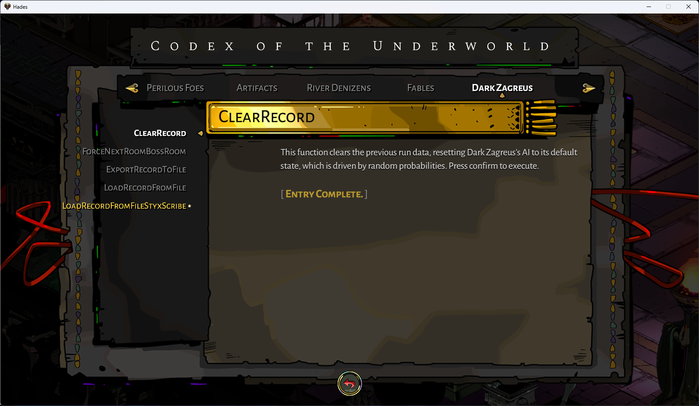
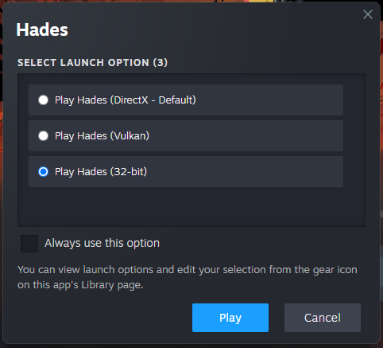
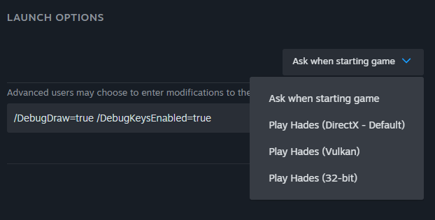

# Dark Zagreus (Hades Mod) beta1.3

A mod for the game [Hades](https://store.steampowered.com/app/1145360/Hades/). It turns the final boss, Hades himself, into a mirror image of the player character, whom I call Dark Zagreus. Inspired by similar concepts in other games, like Dark Link from the Zelda series. In each encounter, Hades equips the same weapon as the player's previous successful run. What sets this mod special is the AI of Dark Zagreus is powered by a deep learning model trained on the player's historical gameplay data of previous successful run. This experimental feature creates a dynamic challenge experience for players with the individual's style and strategies.

## Requirements
- [Hades](https://store.steampowered.com/app/1145360/Hades/) (V1.38290 or above)
- [Mod Importer](https://www.nexusmods.com/hades/mods/26)
- [ModUtil](https://www.nexusmods.com/hades/mods/27)
- [Max Save With No Run History](https://www.speedrun.com/hades/resources/hshp9) (Optional)

## Installation

### Step 1 - Install Mod Importer
Follow the [tutorial](https://www.nexusmods.com/hades/mods/26) to install mod importer. We will use this to import mods. Installing it is easy, drag the extracted file `modimporter.exe` to `{$YourHadesRootFolder}\Content\`. Next, create a `Mods` folder inside the Content folder. The Mods folder will be the place for the mods you want to import.

#### Where is the root folder for Hades?
The location varies depending on which platform you are using.
- Steam: Library > Right-click on Hades > Manage > Browse local files > Content
- Epic Games: C:\Program Files\Epic Games\Hades\Content
- Microsoft Store: `<location you chose when installing via the Store>`\Hades\Content\Content

### Step 2 - Import ModUtil
Dark Zagreus uses some functions from ModUtil, so installing ModUtil is required. Download [ModUtil](https://www.nexusmods.com/hades/mods/27) and place it in the `Mods` folder.

### Step 3 - Import Dark Zagreus
To install the mod, download it and place it in the `Mods` folder of Hades, which has shown in the previous steps, the folder is located at `${YourHadesRootFolder}\Content\Mods`. Next, run the mod importer. Once the importer has finished, you're ready to go.

### Step 4 - Import a clean 100% save file (Optional)
The mod will save some data into your save file. Since it replaces the final boss, you might miss some story elements if you haven't finished the game yet. For the best experience, it is highly recommended to use a save file from a completed game. You can duplicate your save file as a backup. Alternatively, you can add a 100% save file to your game. For this, I suggest using [Max Save With No Run History](https://www.speedrun.com/hades/resources/hshp9) by ellomenop from the speedrun community.

### How to import/backup a save file
The save file is located at `C:\Users\${YourUserName}\Documents\Saved Games\Hades`. The files are named according to the pattern `ProfileX.sav`, where X is the number of the save slot. To back up a save file, simply copy the file to another location or rename it. To import a save file, rename the file to ProfileX.sav, with X being the number of the save slot you want to use.

## Feature
After installing the mod, you can start a run. At the end of the run, you will see Dark Zagreus standing opposite you, ready to fight. In the first attempt, since there is no previous run data, Dark Zagreus will equip the most basic weapon, and his AI will be driven by random values. After completing the run, the next time you encounter Dark Zagreus, he will equip the weapon you used in your previous run.

> Note that only successful runs will be considered. If you die during a run, the AI will not be updated.

> Real-time deep learning model training takes time. The model is trained when you enter the boss room, so the screen might freeze for a few seconds during this process. 

### Commands
This mod also offers debug features. To see the available commands, press `C` (or the corresponding button for your platform) to open the Codex in the game.
There are a list of commands. To execute them, select a command and press `Enter` (or the corresponding confirm button).

Here are some description about the commands:
#### Force next room boss room 
This function skips directly to the final boss level, which is useful if you have a successful previous run and want to quickly test fighting Dark Zagreus. It changes your next room to the boss room.
#### Clear record
This function clears the previous run data, resetting Dark Zagreus's AI to its default state, which is driven by random probabilities. In most scenarios, you won't need to use this function. I use it when my previous data is corrupted, but that shouldn't happen now because I've implemented data version handling. Old version data will be automatically cleared.
### x86(32-bit) version only
#### How to start the x86 version?
When you start the game, there should be several options to choose. x86 is the last option. 

If you don't see it. You can also find it by right click the game on Steam -> Properties -> General -> Launch Options.

#### Export record to file
This function saves your previous run record to file, it is useful when you want to share your record data with someone. The save file will be located at `${YourHadesRootFolder}\x86\DZRecord.log`.
#### Load record from file
This function loads record from file, it is useful when you want to load other's record data. The file should be placed as `${YourHadesRootFolder}\x86\DZRecord.log`. Inside the game, execute `LoadRecordFromFile` command to load file. Dark Zagreus in your next encounter will be driven by this record.

## Limitation
### Cast, call, and summon support
Cast, call, and summon are complex systems in Hades, requiring considerable time to implement. Therefore, Dark Zagreus will not use these actions. Cast might be supported in the future as it is somewhat easier to implement. This also leads to a problem that upgraded weapon powers related to Cast are all missing right now.

### Boons and Daedalus Hammer
Boons and Daedalus Hammer upgrades are driven by the trait system in the game code. The challenge in implementing these for non-player characters is that many mechanics are specifically designed for player use. The functions these upgrades introduce are tailored for manipulating the player character, requiring replication and reimplementation of all traits and their functions for Dark Zagreus. This is a substantial amount of work and may be supported in future versions. Other mod developers are welcome to build upon this mod and extend its capabilities.

### Bow Charge VFX
It seems like the bow charge VFX is handled internally, I couldn't make it work. Still looking for a way to fix it.

## Known issues
- Chaos shield is not handled correctly

## Special Thanks
The deep learning library in this mod is a modified version of [luann](https://github.com/wixico/luann) by wixico. Thanks to wixico implementing a lightweight and fast neural network in lua.

Thanks to the [mod community](https://github.com/SGG-Modding) of Hades for providing thorough tutorials. I also appreciate everyone on the Discord server for answering my questions and providing useful information.

The command features is inspired by [CodexMenu](https://www.nexusmods.com/hades/mods/15) mod by LRevolution.

## Trobule Shoorting
### The mod is not applied. Hades is still the same.
Make sure you run the `modimporter.exe`
### When I open the game, a screen shows up saying that save files can't be loaded
Make sure ModUtil and DarkZagreus are imported.

## Dependencies
This mod overrides `ReloadGun` and `ManualReload` function in `Combat.lua`, which might cause problem with other mods which also override this function.

Other wrapped functions: `MarkTargetApply`, `SpearRushBonusApply`, `MarkTargetSpinApply`, `ShieldThrowProjectileBonusApply`, `GrenadeSelfDamageOutputApply`, `StartNewRun`, `EndRun`, `RecordRunCleared`, `DamageHero`, `DamageEnemy`

## Data Version Change logs

### v6

-- add IsReloading and Ammo
-- add ManualReload action

### v5

- remove charge time, now handle by a random probability within the AI scripts
- add charge attack (Charged version of regular attack, for spears and shields)

### v4

- include MarkTargetRecently, which checks if a target is marked by a special weapon within duration(depends on the weapon)

### v3

- include GetDamagedRecently and DamageEnemyRecently, which check if self and enemy are damaged within 1 second

### v2

- split dash action to dash toward and dash away, which obviously different in combat tactics

### v1

- initial version